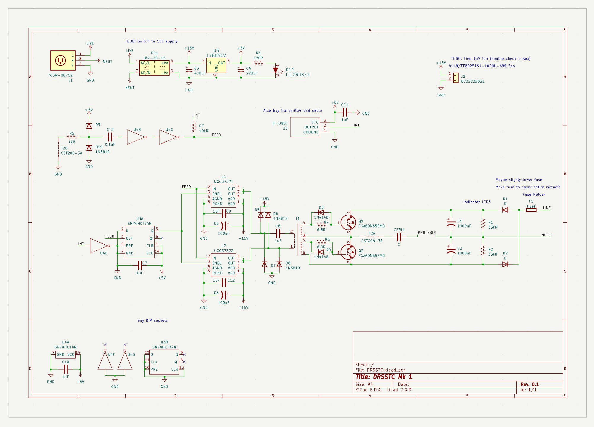

A Dual-Resonant Solid-State Tesla Coil. 

- Designed a custom circuit inspired by [Steve Ward's DRSSTC](https://www.stevehv.4hv.org/drsstc_design.htm)
- Laid out and assembled a custom PCB in KiCad that can handle high voltages and frequencies
- Designed enclosures and support hardware in Fusion 360
- Currently working on winding the secondary coil and programming a microcontroller to serve as a polyphonic interruptor

